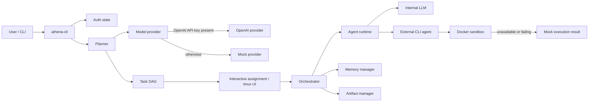

# Athena architecture

Athena is a Rust workspace for planning a user objective as a task DAG and
executing its tasks through internal models or external CLI agents. The current
implementation is an MVP: it preserves the orchestration shape while using
mocked execution when a model provider, Docker, or an agent image is not
available.

## System view

## Components

| Component | Responsibility | Current behaviour |
| --- | --- | --- |
| `athena-cli` | Parses commands, loads authentication, builds the runtime, assigns agents, and renders the terminal workflow. | Uses OpenAI when `OPENAI_API_KEY` is set; otherwise emits a fixed two-task mock plan. |
| `Planner` | Turns an objective into task definitions and translates declared dependency IDs to generated UUIDs. | Requires a JSON `{ "tasks": [...] }` response. All tasks are currently marked as requiring `coding` capability. |
| `Orchestrator` | Registers agent profiles and runs pending tasks once their dependencies are complete. | Executes eligible tasks serially and emits lifecycle/log events. It detects dependency deadlocks. |
| `AgentRuntime` | Selects internal-model or external-CLI execution for an assigned agent. | Streams presentation-style logs for external agents; falling back to a successful mock result on Docker failure. |
| `Sandbox` | Owns the Docker connection and is intended to isolate execution. | Connection is optional and `execute_code` currently returns mock output. |
| `ArtifactManager` | Persists task-produced files under `athena_workspace`. | Supports registration and lookup, but is not yet called from task execution. |
| `MemoryManager` | Holds reusable context. | Stores items in memory; retrieval returns every item rather than ranked search. |

## Execution flow

1. `athena run "<objective>"` loads the saved authentication state and chooses a model provider.
2. The planner requests a JSON task DAG and converts task IDs to internal UUIDs.
3. The CLI prompts for an agent assignment per task and creates a tmux-based display.
4. The orchestrator starts a task only after all listed dependencies are completed.
5. The agent runtime runs either an internal provider/tool loop or an external command in Docker.
6. Completion or failure is emitted as an `OrchestratorEvent`; the current CLI ends with a static synthesis message.

## Mock-mode contract

Mock mode keeps the demo runnable without infrastructure:

- The CLI's `MockProvider` returns `Mock Architecture` followed by `Mock Database`.
- Docker connection and container failures are converted to successful simulated results.
- The sandbox returns `mock output` rather than starting a container.
- Tool writes in the internal-model loop are acknowledged but not persisted.

This means a successful mock run demonstrates planning, dependency ordering, and
terminal presentation; it does not validate agent output, sandbox isolation, or
artifact production.

## Production hardening priorities

1. Replace simulated Docker execution with a restricted container policy:
   read-only base image, explicit workspace mount, non-root user, CPU/memory/
   time limits, disabled network by default, and captured exit status.
2. Execute eligible independent tasks concurrently while respecting the DAG,
   retries, cancellation, and per-run token/cost budgets.
3. Route by `AgentProfile.capabilities`, cost, and latency rather than relying
   on manual selection and a fallback agent.
4. Persist task results, logs, and artifacts; pass dependency artifacts and
   retrieved memory into downstream task context.
5. Replace the static final message with a provider-backed synthesis that cites
   completed task results and clearly reports failures.
